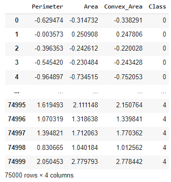
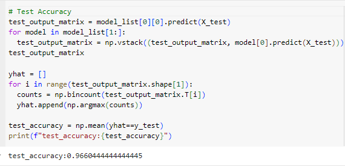

# Rice Varieties Classification Report

### Table of Contents
* [Introduction](#introduction)
* [Method](#method)
* [Result](#result)
* [Discussion](#discussion)
* [Conclusion](#conclusion)
* [Statement of Collaboration](#statement-of-collaboration)

## Introduction

## Method
### Preprocess the data
* Load the image from the dataset to check the quality of the images.
* Check the size of the images and unify them to the same size.
* Convert labels to categories, `Arborio （1）-> Arborio`.
* Convert images to matrices.
* Compute feature matrix from image matrices.
* Manually add the categories to the feature matrix, like rice classification.
* Standardize the image matrix for later model building.
* Analyze feature data and remove data that affects model accuracy. Remove missing values, redundant features, unnecessary samples, outliers, and duplicate records in the data to reduce redundancy.

* **Choose Key Features**
  * Due to the wide and disparate range across various features from the above pair plot, we normalized and standardized three key features (`Perimeter`(0.71), `Area`(0.65), and `Convex_Area`(0.65)) within the `preprocess_rice_data()` function, as they show a higher correlation with `class`.

* **Label Encoding**
  *  We also encoded the categorical rice types (`Basmati`, `Jasmine`, `Arborio`, `Ipsala`, and `Karacadag`) by mapping them to numerical values ranging from 0 to 4.
* **Normalize and Standardize**
  * Minmax Normalization makes all eigenvalues ​​between [0, 1], eliminating the impact of different eigenvalue magnitudes. Standardization converts data into a standard normal distribution with a mean of 0 and a standard deviation of 1, which improves the efficiency of subsequent operations on the data.  

#### First Training Model
* **Logistic Regression model**
    We used logistic regression models to classify the types of rice.
* **Feature Pairing and Model Training**
  * We paired different types of rice to train different models. For example, Type 1 vs. Type 2, Type 1 vs. Type 3, and so on.
  * Each pair was used to train a separate instance of the logistic regression model. In the end, we have a total of 10 models, each trained on two of the types of rices. The following are 10 Logistic Regression models and their corresponding **log losses**:  

* **Scoring Mechanism**
  * After training, each model's predictions on the test set were combined into a single matrix.  
  
Each row is the prediction of each model for the test set, and each column is the prediction result of different models for the same sample.
  * The final classification was based on a scoring mechanism. For each test sample, the most frequent prediction, that is **mode**, obtained from all these models was the final output in this scoring approach. Thus, the final classification takes much from multiple models applied to further enable the overall accuracy to increase significantly.
* **Evaluate**
* Train_Accuracy:  

* Test_Accuracy:  

* Classification Report:  

### Question
* **Where does your model fit in the fitting graph?**
  * We think that our model is in a good fit. The training accuracy and test accuracy are both high and close. And according to the Classification report, for all rice classifications, the model's precision, recall and f1-score are at high values

* **What are the next models you are thinking of and why?**
  * Since our goal is to distinguish 5 types of rice, which is a multi-classification problem, using **Neural Networks** can meet the needs of having multiple outputs. A neural network can be implemented by using a sigmoid activation function in the output layer, allowing each output node to predict the class independently.

### Conclusion section
* **What is the conclusion of your 1st model?**
  * For problems that require multiple classifications, using a logistic regression model seems to require more steps and details that require attention. Since there are a total of 5 types of rice that we trained this time, we were able to build 10 models to distinguish them separately. However, if the types of rice continue to increase, then continuing to use the logistic regression model to judge the efficiency will decrease, and the statistics and judgment of the results of each model will also become complicated.
* **What can be done to possibly improve it?**
   * First of all, in terms of the use of the model, it seems to be a better decision to use a neural network rather than a logistic regression model, because this is a multi-classification problem, and neural networks have better performance for predicting tasks belonging to multiple categories. Then, for the final statistical method of the test results using the logistic regression model, we adopted the mode method, which may produce multiple different modes and lead to confusion in the test results. Perhaps it would be a better idea to use the sum or maximum probability of each model's probability for the test result.

## Result

## Discussion

## Conclusion

## Statement of Collaboration
