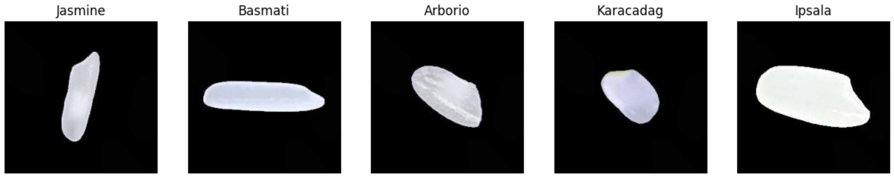
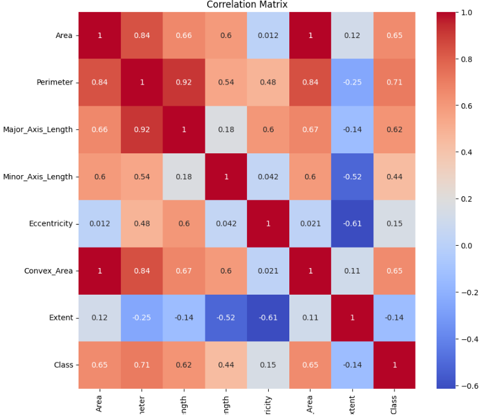
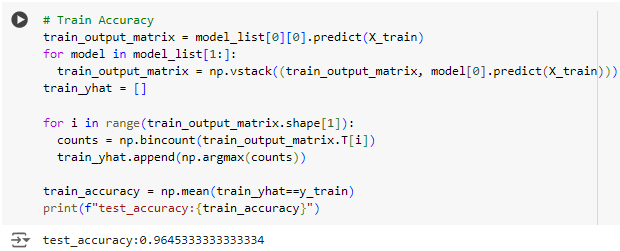
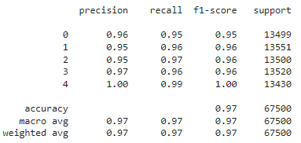

# Rice Varieties Classification Report

### Table of Contents
* [Introduction](#introduction)
* [Method](#method)
* [Result](#result)
* [Discussion](#discussion)
* [Conclusion](#conclusion)
* [Statement of Collaboration](#statement-of-collaboration)

# Introduction  

Rice, an agriculturally important food for many countries and regions, has a history of cultivation for thousands of years. Over time, new rice varieties have been introduced to enhance its traits such as disease resistance and nutritional content. However, traditional classification among different types of rice is done by manual visual inspection which is often challenging, slow, and results in higher error due to their similarity in size, shape, and color. Thus, developing efficient and accurate classification methods is crucial for helping farmers and producers ensure consistent quality control and segregating different rice varieties for specialized markets.

In this project, we focus on classifying five types of rice: Arborio, Basmati, Ipsala, Jasmine, and Karacadag.  

We analyze some of their key features, including Area, Perimeter, Major_Axis_Length, Minor_Axis_Length, Eccentricity, Convex_Area, and Extent, extracted from images. Our dataset comprises 75,000 images, with 15,000 images per rice variety. The image sizes are all 250x250 pixels on a dark background with exactly one rice in the middle of the image.
# Method
### Model 1 - Logistic Regression
### Preprocess the data
* Load the image from the dataset to check the quality of the images.
* Check the size of the images and unify them to the same size.
* Convert labels to categories, `Arborio （1）-> Arborio`.
* Convert images to matrices.
* Compute feature matrix from image matrices.
* Manually add the categories to the feature matrix, like rice classification.
* Standardize the image matrix for later model building.
* Analyze feature data and remove data that affects model accuracy. Remove missing values, redundant features, unnecessary samples, outliers, and duplicate records in the data to reduce redundancy.

* **Choose Key Features**
  * Due to the wide and disparate range across various features from the above pair plot, we standardized three key features (`Perimeter`(0.71), `Area`(0.65), and `Convex_Area`(0.65)) within the `preprocess_rice_data()` function, as they show a higher correlation with `class`.

* **Label Encoding**
  *  We also encoded the categorical rice types (`Arborio`: 0, `Jasmine`: 1, `Karacadag`: 2, `Basmati`: 3, `Ipsala`: 4) by mapping them to numerical values ranging from 0 to 4.
* **Normalize and Standardize**
  * Minmax Normalization makes all eigenvalues ​​between [0, 1], eliminating the impact of different eigenvalue magnitudes. Standardization converts data into a standard normal distribution with a mean of 0 and a standard deviation of 1, which improves the efficiency of subsequent operations on the data.  


## Our First Model:
* **Logistic Regression model**
  *  We used logistic regression models to classify the types of rice.
* **Feature Pairing and Model Training**
  * We paired different types of rice to train different models. For example, Type 1 vs. Type 2, Type 1 vs. Type 3, and so on.
  * Each pair was used to train a separate instance of the logistic regression model. In the end, we have a total of 10 models, each trained on two of the types of rices. The following are 10 Logistic Regression models and their corresponding **log losses**:  

* **Scoring Mechanism**
  * After training, each model's predictions on the test set were combined into a single matrix.  
  
Each row is the prediction of each model for the test set, and each column is the prediction result of different models for the same sample.
  * The final classification was based on a scoring mechanism. For each test sample, the most frequent prediction, that is **mode**, obtained from all these models was the final output in this scoring approach. Thus, the final classification takes much from multiple models applied to further enable the overall accuracy to increase significantly.
### Evaluate
* Train_Accuracy:  

* Test_Accuracy:  

* Classification Report:  


### Question
* **Where does your model fit in the fitting graph?**
  * We think that our model is in a good fit. The training accuracy and test accuracy are both high and close. And according to the Classification report, for all rice classifications, the model's precision, recall and f1-score are at high values

* **What are the next models you are thinking of and why?**
  * Since our goal is to distinguish 5 types of rice, which is a multi-classification problem, using **Neural Networks** can meet the needs of having multiple outputs. A neural network can be implemented by using a sigmoid activation function in the output layer, allowing each output node to predict the class independently.

### Conclusion section
* **What is the conclusion of your 1st model?**
  * For problems that require multiple classifications, using a logistic regression model seems to require more steps and details that require attention. Since there are a total of 5 types of rice that we trained this time, we were able to build 10 models to distinguish them separately. However, if the types of rice continue to increase, then continuing to use the logistic regression model to judge the efficiency will decrease, and the statistics and judgment of the results of each model will also become complicated.
* **What can be done to possibly improve it?**
   * First of all, in terms of the use of the model, it seems to be a better decision to use a neural network rather than a logistic regression model, because this is a multi-classification problem, and neural networks have better performance for predicting tasks belonging to multiple categories. Then, for the final statistical method of the test results using the logistic regression model, we adopted the mode method, which may produce multiple different modes and lead to confusion in the test results. Perhaps it would be a better idea to use the sum or maximum probability of each model's probability for the test result.

## Our Second Model:
* **Artificial Neural Network model**
  * In this project, we utilized artificial neural networks to classify the types of rice based on given input features. 
* **Tuning and Model re-Training**
  * The following sections detail how the model was built, tuned, and trained using Keras Tuner for hyperparameter optimization.
    * Step 1: Building the Model
      * The function ```buildHPmodel(hp)``` is designed to construct a neural network model with tunable hyperparameters. The model begins with a Flatten layer, which is the input layer for model. Follow by some hidden layers, the loop is used to a some number of dense layers, which ranges from 4 to 10, and the activation function for each layer is selected from softmax, sigmoid or relu. To prevent overfitting, we introduce a dropout layer, which randomly setting a fraction of input units to zero during training. And a output layer with five nodes with activation function options: softmax, sigmoid or relu.
    * Step 2: Hyperparameter Tuning with Keras Tuner
      * We used Keras Tuner(RandomSearch) to improve the model's performance by finding the best set of hyperparameters. Here is our setup for tuner:
      ```python
      tuner = RandomSearch(
          buildHPmodel,
          objective="val_accuracy",
          max_trials=5,
          executions_per_trial=1,
          project_name="dry_beans_dataset"
      )
      ```
    * Step 3: Training the Model with Optimal Hyperparameters
      We proceed to train the model using the optimal hyperparameters. The best hyperparameters are used to build a new model instance via ```tuner.hypermodel.build(best_hps)```. Next, we want to train the model using train data set ```(X_train, y_train)```. Then we evaluate our model using ```(X_test, y_test)```.
### Evaluate
* **Test Accuracy:**  

```
Test Accuracy: 0.9577
```
* **Loss:** 

```
Test Loss: 0.1651
```
* **Accuracy for each rice variety:**
```python
for i, class_name in enumerate(ohe.get_feature_names_out()):
    precision = TP[i] / (TP[i] + FP[i])
    recall = TP[i] / (TP[i] + FN[i])
    f1_score = 2 * (precision * recall) / (precision + recall)
    print(f"{class_name}:")
    print(f"  Precision: {precision:.4f}")
    print(f"  Recall: {recall:.4f}")
    print(f"  F1-score: {f1_score:.4f}")
```

Output:
```
Class_0:
  Precision: 0.9194
  Recall: 0.9478
  F1-score: 0.9334

Class_1:
  Precision: 0.9404
  Recall: 0.9626
  F1-score: 0.9514

Class_2:
  Precision: 0.9596
  Recall: 0.9349
  F1-score: 0.9471

Class_3:
  Precision: 0.9747
  Recall: 0.9663
  F1-score: 0.9705

Class_4:
  Precision: 0.9993
  Recall: 0.9778
  F1-score: 0.9884
```
* **Confusion Matrix:**

Code:
```python
cm = confusion_matrix(np.argmax(y_test,axis=1), np.argmax(predictions,axis=1))

TP = np.diagonal(cm)
FP = cm.sum(axis=0) - TP
FN = cm.sum(axis=1) - TP
TN = cm.sum() - FP - FN - TP

print("TP: ", TP)
print("FP: ", FP)
print("FN: ", FN)
print("TN: ", TN)
```

Output:
```
TP:  [2922 2885 2801 2894 2864]
FP:  [256 183 118  75   2]
FN:  [161 112 195 101  65]
TN:  [11661 11820 11886 11930 12069]
```

The index correspond to certain rice variety where we encoded in preprocessing part: 
```
{'Arborio': 0, 'Jasmine': 1, 'Karacadag': 2, 'Basmati': 3, 'Ipsala': 4}
```
* **Confusion Matrix Visualization:**


# Result
In order to classify the class of rice, two algorithms are implemented. First one is a combination of 10 logistic regression, yielding a train accuracy of `0.9645` and test accuracy of `0.9660`. Second one is a neural network, yielding a train accuracy of `0.9620` and test accuracy of `0.9577 `. The best parameter for the neural network is 
<center>

 Type             |  Value | Activation_Function
 :---------------:|:-------------:|:------------------:|
 number of layer | 10 | N/A
 layer 1 | 86 units | softmax 
 layer 2 | 127 units | relu 
 layer 3 | 4 units | relu 
 layer 4 | 4 units | softmax 
 layer 5 | 45 units | sigmoid 
 layer 6 | 86 units | relu 
 layer 7 | 86 units | softmax 
 layer 8 | 45 units | relu
 layer 9 | 86 units | relu
 layer 10 | 86 units | relu
 learning rate units | 0.0009075662940740351 | N/A
 optimizer | Adagrad | N/A
 
</center>

fit_accuracy             |  fit_loss
:-------------------------:|:-------------------------:
 | 
# Discussion

In this project, we aimed to classify five different types of rice: Arborio, Basmati, Ipsala, Jasmine, and Karacadag using a variety of machine learning and deep learning methods. The main parts of the project are divided into data preprocessing, feature extraction, model selection and training, hyperparameter tuning, and model evaluation.

### Data Preprocessing

We started with a dataset that consists of 75,000 images of rice grains—15,000 of each type of rice, each being an image of size 250 by 250 pixels containing one rice grain in the middle of the picture, and the rest of the image with a black background. Preprocessing the data involves the extraction of useful features from the images.

### Feature Extraction

Our initial approach was to use OpenCV to extract geometrical features from the rice grain. We selected this approach because of its simplicity and our hypothesis that different rice varieties are likely to have distinct characteristic shapes. We binarized the image and found the contours in the image to compute different geometrical features for each of the contours.

### Standardizing Features

Standardization ensures all features have the same scale, which helps the model train well. We standardized our features using `StandardScaler`.

### Model Selection and Training

Initially, we selected logistic regression models and trained binary classifiers for pairs of the selected classes, calculating the corresponding log loss values for each. Finally, by using these log loss values, a voting classifier was built. This served as our baseline before moving to more complex models. We were pleasantly surprised by how well logistic regression performed on our dataset. It might indicate strong discriminativity among features but also raises concerns about high complexity in the dataset. Typically, if a logistic regression model works well for a task, it suggests that the differences are more subtle and non-linear.


### Deep Learning Model and Hyperparameter Tuning

Given the promising results from logistic regression, we moved on to explore deep learning models. We used convolutional neural networks (CNNs) due to their effectiveness in image classification tasks. Our CNN architecture was designed to capture the intricate patterns and textures in rice grains that logistic regression might miss.

To further improve performance, we used Keras Tuner for hyperparameter search. We hypothesized the presence of complex nonlinear relationships in our data, beyond what simpler models could capture. Indeed, in support of this hypothesis, the deep learning model showed improved performance at the expense of a decrease in interpretability.


### Results and Discussion

Both logistic regression and deep learning models were trained, and both showed high accuracy on the test set. However, this result is not without questions about its reliability. Further details on the results are discussed below:

### Reliability of Results

We achieved about 97% accuracy on the test set; therefore, it remains highly predictive. However, the dataset is generated artificially, and images are on black backgrounds, which may not be the case in reality. So, the model's performance might degrade while working in real applications.

### Limitations and Improvements

The primary limitation of our model is overfitting. We can improve this by increasing the size of the data, as well as using data augmentation techniques and regularization methods. Other approaches to try for further performance improvement may include trying out additional models and complex network architectures.

### Future Work

In the future, transfer learning can be tried using pre-trained convolutional neural networks (CNNs), such as ResNet and VGG, for feature extraction and classification. Further methods of hyperparameter tuning—such as Bayesian optimization—might be considered in an attempt to find better hyperparameter configurations.

Overall, it has been a practical learning process in building a machine and deep learning project from scratch: data preprocessing, feature extraction, model selection and training, and hyperparameter tuning. The results are not perfect; however, this process gave us insight into machine learning and deep learning, enabling us to identify problems and solve them within a project.


# Conclusion

# Statement of Collaboration
#### Jiawei Huang
* **Title**: Team Leader / Project Manager / Programmer
* **Contribution**: 
  * Organize regular team meetings to discuss specific plans for weekly milestones. Also, Discuss and resolve potential problems in the project.
  * Regularly check project progress and make adjustments based on team feedback and project requirements.
  * Participated in and code the training and evaluation of two models in the project
  * Participate in the preparation of weekly project reports and complete the requirements of Milestone tasks.
    
#### Xinheng Wang
* **Title**: Programmer/Team member
* **Countribution**:
  * Finished the exploration step for Milestone 1.
  * Worked on coding, training, and evaluating the second model for the project.
  * Contributed to weekly project coding and helped debug the code.
  * Write the discussion section and identify the best model for the written report.
