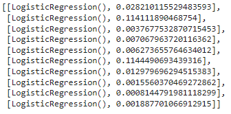

# CSE151A_Group_Project-Rice_Classification

#### Team member:
* Po-Yu Lai
* Chaowen cao
* Xinheng Wang
* Jiawei Huang
* Zhenhan Hu
* Shiwei Yang

### Table of Contents
* [Milestone 2: Data Exploration & Initial Preprocessing](https://github.com/Astraeven0502/CSE151A_Group_Project-Rice_Classification/tree/main#milestone-2-data-exploration--initial-preprocessing---colab-notebooks)
* [Milestone 3: Pre-Processing](https://github.com/Astraeven0502/CSE151A_Group_Project-Rice_Classification/tree/main#milestone-3-pre-processing)

# Milestone 2: Data Exploration & Initial Preprocessing - Colab Notebooks
[Here is our Google Colab Notebooks for Milestone 2](https://colab.research.google.com/drive/1bM3yfj60lDQ3N6NRP37qrv_-08Auf9Cd?usp=sharing)

# Data exploration

We have 5 rice varieties in our image data, Arborio, Basmati, Ipsala, Jasmine, and Karacadag. The total number of the images is 75,000. Each of the varieties has 15,000 images from different angles and sizes. The image sizes are all 250x250 pixels, but the sizes of each rice are different. Every image is in a dark background with exactly one rice in the middle of the image. We will look at this image and use OpenCV to get the feature from those image datasets. The feature we will extract are:
|    | Variable Name     | Role    | Type       | Description                                                                                                     |
|---:|:------------------|:--------|:-----------|:----------------------------------------------------------------------------------------------------------------|
|  0 | Area              | Feature | Integer    | Returns the number of pixels within the boundaries of the rice grain                                            |
|  1 | Perimeter         | Feature | Continuous | Calculates the circumference by calculating the distance between pixels around the boundaries of the rice grain |
|  2 | Major_Axis_Length | Feature | Continuous | The longest line that can be drawn on the rice grain, i.e. the main axis distance                               |
|  3 | Minor_Axis_Length | Feature | Continuous | The shortest line that can be drawn on the rice grain, i.e. the small axis distance                             |
|  4 | Eccentricity      | Feature | Continuous | It measures how round the ellipse, which has the same moments as the rice grain                                 |
|  5 | Convex_Area       | Feature | Integer    | Returns the pixel count of the smallest convex shell of the region formed by the rice grain                     |
|  6 | Extent            | Feature | Continuous | Returns the ratio of the region formed by the rice grain to the bounding box pixels   

## Retrieve the data

```bash
!git lfs install
!git clone https://huggingface.co/datasets/nateraw/rice-image-dataset
!unzip /content/rice-image-dataset/rice-image-dataset.zip -d /content/rice-image-dataset/
```

## Library used

```python
import os
import cv2
import numpy as np
import pandas as pd
import matplotlib.pyplot as plt
```

## Data Exploration

We performed the following data exploration steps:

1. **Extract Features From Image Data Using extract_features() Function**:
   - Example code:
    ```python
    # Define the main directory path
    main_directory_path = '/content/rice-image-dataset/Rice_Image_Dataset'

    # Get all class subdirectories
    classes = os.listdir(main_directory_path)
    classes.remove('Rice_Citation_Request.txt')
    all_features = []

    # Iterate through each class subdirectory
    for class_name in classes:
        class_path = os.path.join(main_directory_path, class_name)
        if os.path.isdir(class_path):
            # Get all image files in the class directory
            for filename in os.listdir(class_path):
                if filename.endswith(".png") or filename.endswith(".jpg"):
                    image_path = os.path.join(class_path, filename)
                    features = extract_features(image_path)
                    if features:
                        all_features.extend(features)
    ```

2. **Described the number of classes, number of images**.
    - Example code:
    ```python
    # Initialize DataFrame
    columns = ["Area", "Perimeter", "Major_Axis_Length", "Minor_Axis_Length", "Eccentricity", "Convex_Area", "Extent"]
    df = pd.DataFrame(all_features, columns=columns)

    # Drop rows with NaN values
    df = df.dropna()

    # Add additional columns
    df['Variable Name'] = ["Feature"] * len(df)
    df['Role'] = ["Feature"] * len(df)
    df['Type'] = ["Continuous"] * len(df)
    df['Description'] = [""] * len(df)
    df['Units'] = [""] * len(df)
    df['Missing Values'] = ["no"] * len(df)

    # Rearrange column order
    df = df[["Area", "Perimeter", "Major_Axis_Length", "Minor_Axis_Length", "Eccentricity", "Convex_Area", "Extent"]]

    # Count the number of classes and images
    num_classes = len(classes)
    num_images = len(all_features)

    print(f'Number of classes: {num_classes}')
    print(f'Number of images: {num_images}')
    ```

3. **Display the DataFrame for the features**
   ```python
   print(df)
   ```

4. **Plot Example Classes of the Image for each varieties**:
   - Example code:

    ```python
    # Plot three images for each variety
    fig, axs = plt.subplots(3, len(classes), figsize=(15, 10))

    for i, class_name in enumerate(classes):
        class_path = os.path.join(main_directory_path, class_name)
        if os.path.isdir(class_path):
            image_paths = os.listdir(class_path)[:3]
            for j, image_path in enumerate(image_paths):
                image_path = os.path.join(class_path, image_path)
                image = cv2.imread(image_path)
                image = cv2.cvtColor(image, cv2.COLOR_BGR2RGB)

                # Plot the image
                axs[j, i].imshow(image, cmap='gray')
                axs[j, i].set_title(class_name)
                axs[j, i].axis('off')

    plt.show()
    ```
    

5. **Print the data description and check the number of missing values in each column**:


6. **Plot the correlation matrix heatmap**


7. **Plot the Pairplot**


All exploration steps are implemented in the Jupyter notebook and the code is available in the repository.

## Preprocess the data
* Load the image from the dataset to check the quality of the images.
* Check the size of the images and unify them to the same size.
* Convert labels to categories, `Arborio （1）-> Arborio`.
* Convert images to matrices.
* Compute feature matrix from image matrices.
* Manually add the categories to the feature matrix, like rice classification.
* Standardize the image matrix for later model building.
* Analyze feature data and remove data that affects model accuracy. Remove missing values, redundant features, unnecessary samples, outliers, and duplicate records in the data to reduce redundancy.

# Milestone 3: Pre-Processing
[Here is our Google Colab Notebooks for Milestone 3](https://colab.research.google.com/drive/1PEwfDU62j56QCuqCfRH3QHhE-IZpv4LM?usp=sharing)

### Preprocess Data
* **Choose Key Features**
  * Due to the wide and disparate range across various features from the above pair plot, we normalized and standardized three key features (`Perimeter`(0.71), `Area`(0.65), and `Convex_Area`(0.65)) within the `preprocess_rice_data()` function, as they show a higher correlation with `class`.

* **Label Encoding**
  *  We also encoded the categorical rice types (`Basmati`, `Jasmine`, `Arborio`, `Ipsala`, and `Karacadag`) by mapping them to numerical values ranging from 0 to 4.
* **Normalize and Standardize**
  * Minmax Normalization makes all eigenvalues ​​between [0, 1], eliminating the impact of different eigenvalue magnitudes. Standardization converts data into a standard normal distribution with a mean of 0 and a standard deviation of 1, which improves the efficiency of subsequent operations on the data.  


### First Training Model
* **Logistic Regression model**
    We used logistic regression models to classify the types of rice.
* **Feature Pairing and Model Training**
  * We paired different types of rice to train different models. For example, Type 1 vs. Type 2, Type 1 vs. Type 3, and so on.
  * Each pair was used to train a separate instance of the logistic regression model. In the end, we have a total of 10 models, each trained on two of the types of rices. The following are 10 Logistic Regression models and their corresponding **log losses**:  

* **Scoring Mechanism**
  * After training, each model's predictions on the test set were combined into a single matrix.  
  
Each row is the prediction of each model for the test set, and each column is the prediction result of different models for the same sample.
  * The final classification was based on a scoring mechanism. For each test sample, the most frequent prediction, that is **mode**, obtained from all these models was the final output in this scoring approach. Thus, the final classification takes much from multiple models applied to further enable the overall accuracy to increase significantly.
* **Evaluate**
* Train_Accuracy:  

* Test_Accuracy:  

* Classification Report:  


### Question
* **Where does your model fit in the fitting graph?**
  * We think that our model is in a good fit. The training accuracy and test accuracy are both high and close. And according to the Classification report, for all rice classifications, the model's precision, recall and f1-score are at high values

* **What are the next models you are thinking of and why?**
  * Since our goal is to distinguish 5 types of rice, which is a multi-classification problem, using **Neural Networks** can meet the needs of having multiple outputs. A neural network can be implemented by using a sigmoid activation function in the output layer, allowing each output node to predict the class independently.

### Conclusion section
* **What is the conclusion of your 1st model?**
  * For problems that require multiple classifications, using a logistic regression model seems to require more steps and details that require attention. Since there are a total of 5 types of rice that we trained this time, we were able to build 10 models to distinguish them separately. However, if the types of rice continue to increase, then continuing to use the logistic regression model to judge the efficiency will decrease, and the statistics and judgment of the results of each model will also become complicated.
* **What can be done to possibly improve it?**
   * First of all, in terms of the use of the model, it seems to be a better decision to use a neural network rather than a logistic regression model, because this is a multi-classification problem, and neural networks have better performance for predicting tasks belonging to multiple categories. Then, for the final statistical method of the test results using the logistic regression model, we adopted the mode method, which may produce multiple different modes and lead to confusion in the test results. Perhaps it would be a better idea to use the sum or maximum probability of each model's probability for the test result.
